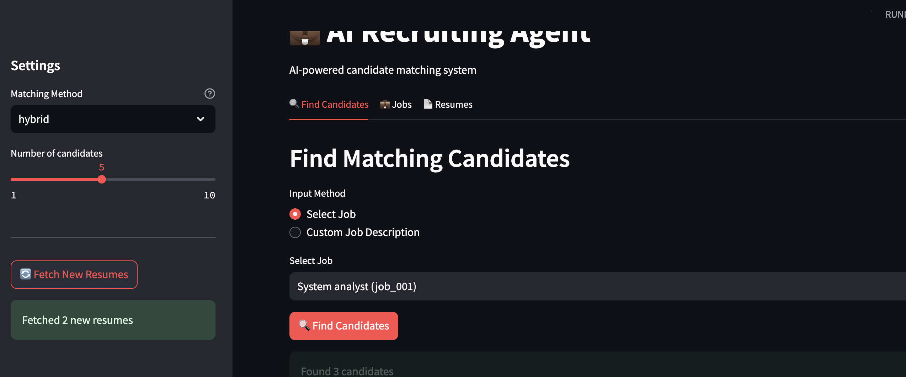
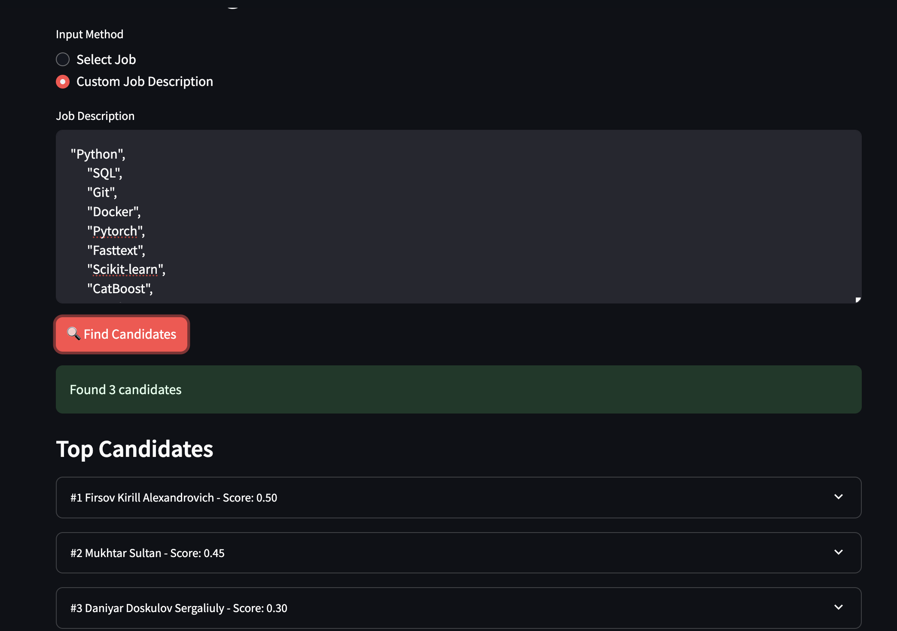
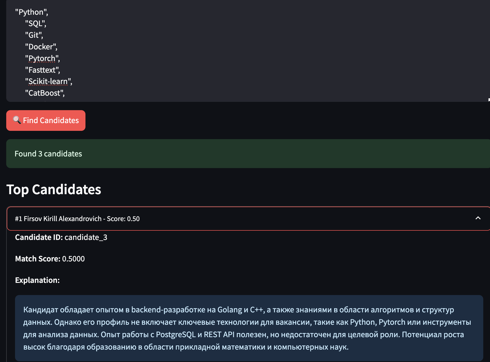
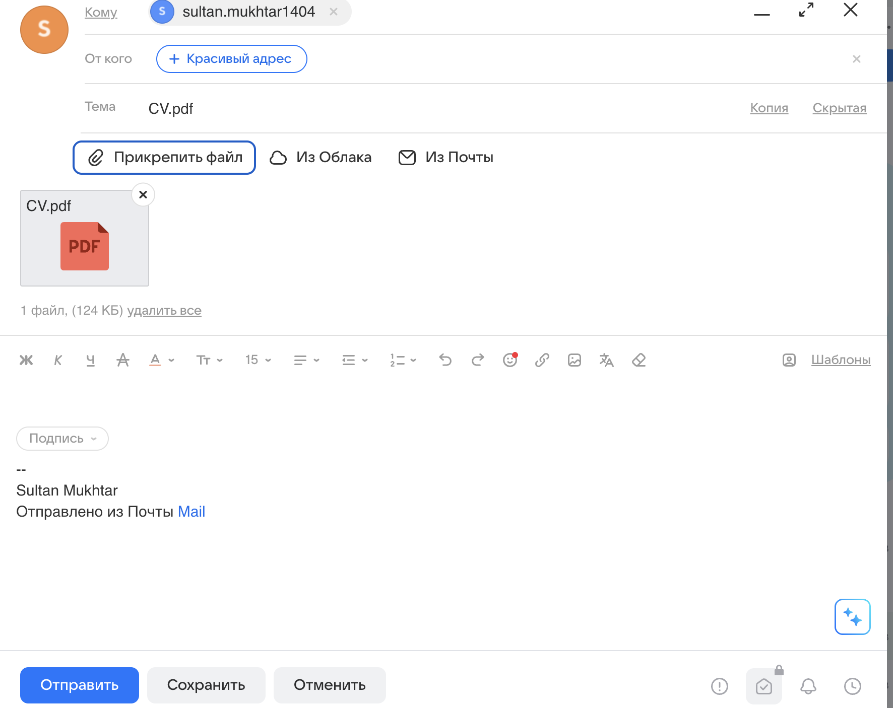
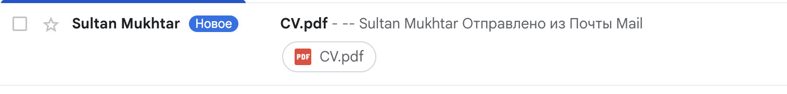
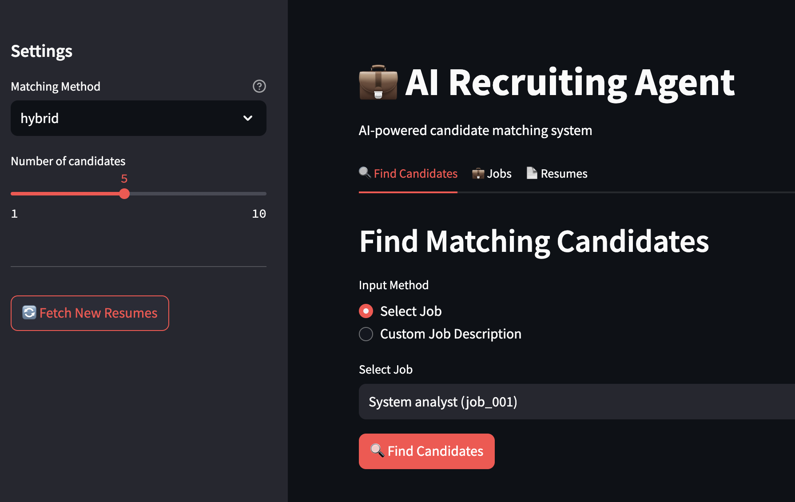
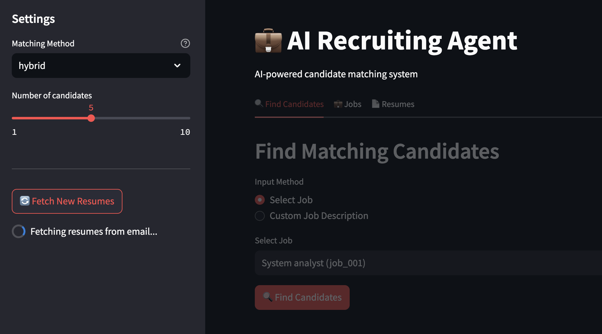

# AI Recruiting Agent

AI-powered candidate matching system that automates resume collection, parsing, and intelligent candidate-job matching using embeddings and LLM-based approaches.

## Overview

This system helps recruiters:
- Automatically collect resumes from email
- Parse resumes from multiple formats (PDF, DOCX, images)
- Match candidates with job openings using AI
- Get explanations for why candidates match specific positions

## Quick Start

### Prerequisites
- Python 3.10+
- Docker & Docker Compose (recommended)
- Email account with IMAP access
- Mistral API key (for LLM matching)

### Setup with Docker

1. Configure environment variables in `.env`:
```bash
EMAIL_ADDRESS=your_email@gmail.com
EMAIL_PASSWORD=your_app_password
MISTRAL_API_KEY=your_mistral_api_key
```

2. Run the application:
```bash
docker-compose up --build
```

3. Access the interfaces:
- **Frontend UI**: http://localhost:8501
- **Backend API**: http://localhost:8000
- **API Docs**: http://localhost:8000/docs

### Local Setup (without Docker)

1. Install dependencies:
```bash
# Backend
cd backend
pip install -r requirements.txt

# Frontend
cd ../frontend
pip install -r requirements.txt
```

2. Install Tesseract OCR:
```bash
# macOS
brew install tesseract tesseract-lang

# Ubuntu/Debian
sudo apt-get install tesseract-ocr tesseract-ocr-eng tesseract-ocr-rus
```

3. Run services:
```bash
# Terminal 1: Backend
cd backend
uvicorn app.main:app --reload --port 8000

# Terminal 2: Frontend
cd frontend
streamlit run streamlit_app.py
```

## System Workflow

The system implements a complete recruitment pipeline demonstrated below:

### 1. Main Interface

*Choose between predefined jobs or custom job descriptions. Select matching method (embedding/LLM/hybrid).*

### 2. Custom Job Input

*Enter custom job requirements with specific skills and technologies.*

### 3. Candidate Search Results

*System returns ranked candidates with match scores (0-1 scale).*

### 4. Detailed Candidate Analysis

*View detailed explanation of why candidate matches the position, including strengths and gaps.*

### 5. Email Composition

*Send resume directly to the system's email for processing.*

### 6. Email Sent Confirmation

*Confirmation that resume has been sent to the recruitment system.*

### 7. Fetch New Resumes

*Click "Fetch New Resumes" button to automatically retrieve and parse new resumes from email.*

## Matching Methodology

### 1. Embedding-based Matching
**Speed**: Fast (2-5 seconds for 100 resumes)
**Method**:
- Uses Qwen/Qwen3-Embedding-0.6B model to generate embeddings
- Calculates cosine similarity between job description and resume embeddings
- Returns candidates ranked by similarity score

**Use case**: Quick initial screening, large candidate pools

### 2. LLM-based Matching
**Speed**: Moderate (depends on API)
**Method**:
- Sends job description + resume to Mistral Small API
- AI analyzes semantic match, experience relevance, skills alignment
- Returns score (0-1) with detailed explanation

**Benefits**:
- Understands context and nuances
- Provides human-readable explanations
- Better at identifying transferable skills

**Use case**: Final candidate selection, detailed evaluation

### 3. Hybrid Matching
**Method**:
- Combines both approaches for optimal results
- Fast embedding-based pre-filtering (top 20 candidates)
- LLM-based detailed analysis of filtered candidates
- Best of both worlds: speed + intelligence

**Use case**: Balanced approach for most recruitment scenarios

## Architecture

```
recruitment_agent_clone/
├── backend/
│   ├── app/
│   │   ├── main.py                    # FastAPI application
│   │   ├── config.py                  # Configuration
│   │   ├── models.py                  # Data models
│   │   ├── email_client.py            # Email integration
│   │   ├── resume_parser.py           # PDF/DOCX/OCR parsing
│   │   └── matching/
│   │       ├── embedding_matcher.py   # Qwen embeddings
│   │       ├── llm_matcher.py         # Mistral LLM
│   │       └── hybrid_matcher.py      # Combined approach
│   └── requirements.txt
├── frontend/
│   ├── streamlit_app.py               # Web UI
│   └── requirements.txt
├── data/
│   ├── jobs/                          # Job descriptions (JSON)
│   └── resumes_parsed/                # Parsed resumes
├── screenshots/                       # Workflow documentation
├── docker-compose.yml
└── .env                               # Configuration
```

## API Endpoints

### `GET /recommendations`
Get ranked candidate recommendations

**Parameters:**
- `job_id` (optional): Job ID from data/jobs/
- `job_text` (optional): Custom job description
- `method` (required): "embedding", "llm", or "hybrid"
- `top_k` (optional): Number of candidates (default: 5)

**Response:**
```json
{
  "job_id": "custom",
  "job_title": "Custom Job",
  "method": "llm",
  "candidates": [
    {
      "candidate_id": "candidate_3",
      "candidate_name": "Firsov Kirill Alexandrovich",
      "score": 0.50,
      "matching_skills": ["Python", "PostgreSQL"],
      "explanation": "Кандидат обладает опытом в backend-разработке..."
    }
  ]
}
```

### `POST /fetch-resumes`
Fetch new resumes from configured email

**Response:**
```json
{
  "status": "success",
  "new_resumes": 2,
  "resumes": ["CV.pdf", "resume.docx"]
}
```

### `GET /jobs`
List all available jobs

### `GET /resumes`
List all parsed resumes

## Configuration

Edit `.env` file:

```bash
# Email Configuration
EMAIL_ADDRESS=sultan.mukhtar1404@gmail.com
EMAIL_PASSWORD=your_gmail_app_password
IMAP_SERVER=imap.gmail.com
IMAP_PORT=993

# API Keys
MISTRAL_API_KEY=your_mistral_api_key
MISTRAL_MODEL=mistral-small-2506

# Optional: HuggingFace token for private models
HF_TOKEN=your_huggingface_token

# Paths
RESUMES_DIR=data/resumes
JOBS_DIR=data/jobs
```

### Gmail Setup
To use Gmail with IMAP:
1. Enable 2-factor authentication
2. Generate App Password: Google Account > Security > App passwords
3. Use App Password in `EMAIL_PASSWORD`

## Technologies

- **Backend**: FastAPI, Python 3.10+
- **Embeddings**: Qwen/Qwen3-Embedding-0.6B (HuggingFace)
- **LLM**: Mistral Small API
- **Parsing**: Pytesseract OCR, PyPDF2, python-docx
- **Frontend**: Streamlit
- **Infrastructure**: Docker, Docker Compose

## Performance

- **Embedding matching**: ~2-5 seconds for 100 resumes
- **LLM matching**: ~5-15 seconds for 10 resumes
- **Hybrid matching**: ~10-20 seconds (optimal balance)
- **Resume parsing**: ~1-3 seconds per file
- **Email fetch**: Depends on attachment count

## Limitations

- Requires Gmail App Password for email integration
- OCR accuracy depends on scan quality
- LLM matching has API costs and rate limits
- Supports PDF, DOCX, TXT, PNG, JPG formats

## Project Structure Details

### Job Descriptions
Store in `data/jobs/` as JSON:

```json
{
  "id": "job_001",
  "title": "Senior Python Developer",
  "description": "Full job description...",
  "requirements": "Technical requirements...",
  "tech_stack": ["Python", "FastAPI", "Docker", "PostgreSQL"]
}
```

### Resume Storage
- Raw files: `data/resumes/`
- Parsed JSON: `data/resumes_parsed/`

Format:
```json
{
  "candidate_id": "resume_1",
  "full_name": "John Doe",
  "email": "john@example.com",
  "skills": ["Python", "FastAPI"],
  "experience": [...],
  "education": [...]
}
```

## Usage Examples

### Python API Client
```python
import requests

# Search candidates
response = requests.get(
    "http://localhost:8000/recommendations",
    params={
        "job_text": "Looking for Python developer with FastAPI experience",
        "method": "hybrid",
        "top_k": 5
    }
)

results = response.json()
for candidate in results['candidates']:
    print(f"{candidate['candidate_name']}: {candidate['score']:.2f}")
    print(f"  {candidate['explanation']}\n")
```

### Fetch New Resumes
```python
# Trigger email fetch
response = requests.post("http://localhost:8000/fetch-resumes")
print(f"Fetched {response.json()['new_resumes']} new resumes")
```

## Troubleshooting

### Email Connection Issues
- Verify IMAP is enabled in Gmail settings
- Use App Password, not regular password
- Check firewall/network restrictions on port 993

### OCR Not Working
- Install Tesseract: `brew install tesseract` (macOS) or `apt-get install tesseract-ocr` (Linux)
- Verify installation: `tesseract --version`

### Low Match Scores
- Ensure job descriptions are detailed and clear
- Check that resumes are properly parsed (view `/resumes` endpoint)
- Try hybrid method for better results

## Development

### Running Tests
```bash
# Test API endpoints
python test_api.py

# Test hybrid matching
python test_hybrid_method.py

# Test email fetching
python test_fetch_resumes.py
```

### Adding New Features
1. Fork the repository
2. Create feature branch
3. Add tests
4. Submit pull request

## License

MIT License

## Support

For issues and questions, please create an issue in the repository.

---

**AI Recruiting Agent v1.0.0** - Automated intelligent candidate matching
